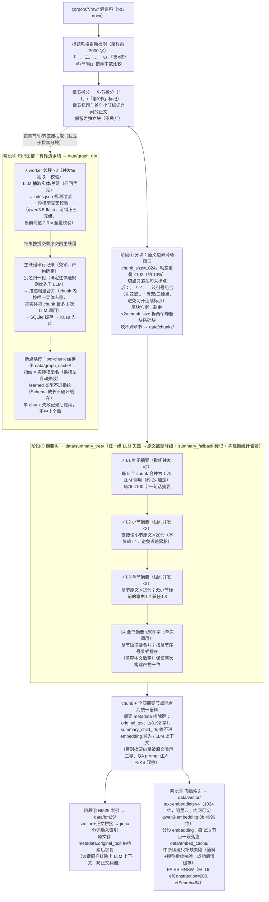
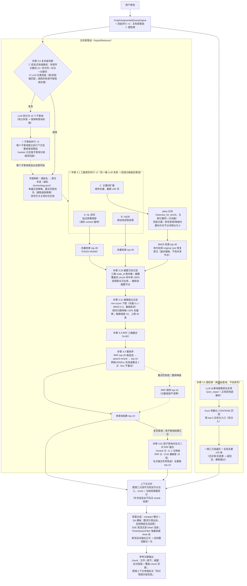

# 中文小说多书 RAG 问答系统

基于 LlamaIndex 的中文小说知识库检索问答系统（多书语料，默认语料《遥远的救世主》）：混合检索（向量 + BM25）、层次化摘要树、Kuzu 知识图谱三路证据融合，经 rerank 后流式生成带引用的回答。

## 功能特性

- **三路查询改写**（并行）：自然语言改写 / HyDE → 向量检索，关键词扩展 → BM25 检索；术语映射（通俗名 → 原文术语）在改写关闭时也生效
- **混合检索**：三路召回 → 摘要冗余过滤 → gap 过滤 → RRF 融合 → cross-encoder 重排（公网 qwen3-rerank / 内网 bge-reranker-v2-m3；失败自动降级 RRF 顺序，瞬时故障先快速重试）
- **查询分解**：复杂问题自动拆分为子查询并行检索，按名次 RRF 融合合并
- **层次化摘要树**：L1 逐块 → L2 小节 → L3 章节 → L4 全书四级摘要，混入主索引解决"宏观问题查不到"；LLM 失败自动降级并显式标记
- **知识图谱**：按节 LLM 抽取实体/关系 → 规则过滤 → 不同模型交叉校验 → 描述合并 → 别名归一化 → Kuzu 持久化；构建为有界流水线并发，SQLite 缓存支持断点续传
- **真流式输出**：SSE 逐 token 渲染，增量剥离 `<think>` 思考块；断流未输出正文时自动整流重试
- **工程化**：分阶段索引（`_DONE.json` 完成标记 + 原子写入）、embedding 分段断点续传、188 例离线单测（无需内网）

## 模型配置

当前默认使用**公网阿里云**端点（`provider="aliyun"`），按角色分配如下：

| 角色 | 模型 | 端点 | API Key 环境变量 |
|---|---|---|---|
| 主模型（回答 / 改写 / 摘要 / 图谱抽取） | `qwen3.6-flash` | `ws-…ap-southeast-1.maas.aliyuncs.com/compatible-mode/v1` | `RAG_PUBLIC_CHAT_API_KEY` |
| 图谱三元组校验（异模型交叉校验） | `qwen3.5-flash` | 同上 | `RAG_PUBLIC_CHAT_API_KEY` |
| 嵌入（**1024 维**，FAISS 维度随之切换） | `text-embedding-v4` | 同上 | `RAG_PUBLIC_EMBED_API_KEY` |
| 重排序 | `qwen3-rerank` | `ws-…cn-beijing.maas.aliyuncs.com/compatible-api/v1/reranks` | `RAG_PUBLIC_RERANK_API_KEY` |

- 公网 key **不入 git**：写在项目根目录 `.env`（已 gitignore）或直接设环境变量；`rag/config.py` 启动时自动加载 `.env`。
- **chat 不能走 `dashscope-us` 公共端点**：该端点带内容审核（`data_inspection_failed`），小说文本会被 400 拦截；ap-southeast-1 workspace 专属部署无此审核，chat 与 embedding 共用同一 workspace key。
- 每个角色的 provider 可独立切回内网：`ANSWER_PROVIDER` / `REWRITE_PROVIDER` / `SUMMARY_LLM_PROVIDER` / `GRAPH_VALIDATE_LLM_PROVIDER` / `EMBED_PROVIDER` / `RERANK_PROVIDER`（`"ollama"` / `"davy"` / `"vllm"` 为原内网配置，参数仍保留）。
- **注意维度差异**：公网 `text-embedding-v4` 为 1024 维，内网 `qwen3-embedding:8b` 为 4096 维——切换 `EMBED_PROVIDER` 后必须删除语料的 `data/vector/` 重建向量索引（`EMBED_VECTOR_DIM` 随 provider 自动切换）。
- 连通性自检：`.venv/bin/python scripts/test_public_llm.py`（四个端点各发一条最小请求）。

## 整体架构

> 图例：**⚡ 标题的子图 = 并行区**（标注并发度）；**虚线 = 降级/兜底路径**；实线 = 主流程。

### 索引构建流程（首次运行自动执行，5 阶段独立持久化）

每阶段完成后写入独立目录 + `_DONE.json` 完成标记（原子写入）；删除某阶段目录即可单独重建，之前的阶段从磁盘加载。



### 查询流程（每次提问）

图检索与整条主检索管线**顶层并发**执行（隐藏图检索的 LLM + Kuzu 延迟）；主管线内部还有两层并行：子查询并行、三路改写并行。



### 并行点一览

| 并行点 | 并发度 | 配置项 | 说明 |
|---|---|---|---|
| 图检索 ∥ 主检索管线 | 2 | 固定（`run_parallel_captured`） | 查询级顶层并发，隐藏图检索延迟 |
| 子查询并行检索 | 2 | `SUBQUERY_MAX_CONCURRENCY` | 每个子查询走完整单查询管线 |
| 三路改写（NL/HyDE/关键词） | 2 | `QUERY_REWRITE_MAX_CONCURRENCY` | 三个彼此独立的 LLM 调用 |
| L1 叶子摘要（批间） | 2 | `SUMMARY_MAX_CONCURRENCY` | 另有批量优化：5 chunk/次调用 |
| L2 / L3 摘要（组间） | 2 | `SUMMARY_MAX_CONCURRENCY` | worker 异常 ⇢ 补降级节点，不缺组 |
| 图谱构建 worker（抽取+校验） | 2 | `GRAPH_EXTRACT_MAX_CONCURRENCY` | 主线程 merge/canonicalize 也是 LLM 调用，实际 LLM 并发最坏 = 2+1 |

> 并发度统一取 2 的原因：Davy 端点经压测 >2 并发触发 429（`DavyLLM` 有指数退避重试兜底，尊重 `Retry-After`）。嵌套场景（子查询 ×2 内层再开三路改写 ×2）最坏瞬时并发 4，超限请求靠重试退避消化，实测可接受。并行统一走 `rag/utils/concurrency.py:run_parallel_captured`——worker 内日志按任务分组、完成后按提交顺序回放，保证 Streamlit/CLI 下日志可读。

### 全景详细流程图（ASCII 版 · 含全部功能与 57 个优化点）

> 单幅连续流程图，按「离线索引 → 在线查询 → 横切基础设施」三部分自上而下串联；
> `★N` 为优化点标注（共 57 个），`∥` 为并行区（标注并发度）。等宽字体下查看效果最佳。

```text
            ╔══════════════════════════════════════════════════════╗
            ║   一、离线阶段：索引构建管线（get_or_build_index）   ║
            ╚══════════════════════════════════════════════════════╝

┌──────────────────────────────────────────────────────────────────────────────┐
│ 管线控制器 get_or_build_index()                             staged_indexer.py│
│                                                                              │
│ ★1 阶段完成检测：每阶段独立目录 + _DONE.json 完成标记；目录存在但无标记      │
│    = 中断残留 → 自动重建。从第一个未完成的启用阶段开始，级联删除其后所有     │
│    阶段目录（依赖它的必须重建），之前的阶段直接从磁盘加载                    │
│ ★2 原子持久化：所有 JSON 先写 tmp 再 os.replace()，写入中断不产生半成品      │
└──────────────────────────────────────────────────────────────────────────────┘
                                       │
                                       ▼
┌──────────────────────────────────────────────────────────────────────────────┐
│ 阶段 1：文档分块  →  data/chunks/                             preprocessor.py│
│                                                                              │
│   corpora/<slug>/raw/ (.txt / .docx)                                         │
│        │ split_by_section()                                                  │
│        ▼                                                                     │
│   章节感知分割    ★3 自动检测标题格式：「一、二、」vs「第X回/章/节/篇」，    │
│        │             按前 3000 字命中数比较取胜者                            │
│        │ _split_body_by_subsections()                                        │
│        ▼                                                                     │
│   小节分割（「　　1」/「第X节」标记）                                        │
│                   ★4 preamble 保留：章节标题到首个小节标记之间的正文保留为   │
│                      独立块（subsection=""），避免章首内容不可检索           │
│        │ HierarchicalChunker（CHUNK_SIZE=1024, CHUNK_OVERLAP=102）           │
│        ▼                                                                     │
│   语义边界滑动窗口分块                                                       │
│    ★5 语义边界右扫描：条件 i  。/！/？/…… + 汉字 → 切在标点右侧              │
│       条件 ii 。"/！"/？"/"。/）。/……" + 汉字 → 切在双/三标点右侧            │
│       （先检 ii 后检 i，避免连续标点被从中间切开）；块不跨章节               │
│    ★6 尾块均衡：剩余 ≤ 2×chunk_size 时拆成两个大小接近的块，防碎小尾块       │
│    ★7 动态重叠：左边界从 prev_R−102 向右扫描语义边界，单侧重叠 ≤102（≈10%）  │
│        ▼                                                                     │
│    ★8 元数据排除键 CHUNK_EXCLUDED_META_KEYS：section_path 不进 embedding /   │
│       LLM 上下文（与 section 重复）；反序列化时重新应用（JSON 不保存排除键） │
│                                                                              │
│   输出: chunks.json（TextNode + file_name/section/subsection 元数据）        │
└──────────────────────────────────────────────────────────────────────────────┘
                                       │
                                       ▼
┌──────────────────────────────────────────────────────────────────────────────┐
│ 阶段 2：摘要树（4 级）  →  data/summary_tree/                 summary_tree.py│
│                                                                              │
│   L1 叶子摘要：每 chunk → ≤100 字一句话                                      │
│    ★9  批量生成：SUMMARY_LEAF_BATCH_SIZE=5，一次 LLM 调用合并 5 个 chunk     │
│        （减少调用次数，约 2x 加速）                                          │
│    ★10 ∥ 批间并发 ×2（SUMMARY_MAX_CONCURRENCY；每线程独立 LLM 实例，无共享） │
│    ★11 降级兜底：LLM 失败/漏答 → 原文截断代替 + summary_fallback=True 标记， │
│        构建结束统计告警（L2/L3 worker 整体异常同样补降级节点，分组不缺失）   │
│        │                                                                     │
│        ▼                                                                     │
│   L2 小节摘要：按 (file, section, subsection) 分组，∥ 组间并发 ×2            │
│    ★12 从小节原文直接生成（不拼 L1 摘要，避免逐级压缩的级联失真）；          │
│        字数上限 = 原文 × 20%（SUMMARY_PARENT_RATIO，下限 200 字）            │
│        │                                                                     │
│        ▼                                                                     │
│   L3 章节摘要：按 section 分组，∥ 组间并发 ×2；字数 = 章节原文 × 15%         │
│    ★13 无小节章跳过 L3：该章仅 1 个 L2 且 subsection="" → L2 兼任章节级摘要  │
│        │                                                                     │
│        ▼                                                                     │
│   L4 全书摘要：≤500 字，单次调用；输入 = 全部章节级摘要文本                  │
│    ★14 章节按序号显式排序（兼容中文数字「第十二回」）→ 两次构建产物一致      │
│        │                                                                     │
│        ▼                                                                     │
│   输出: summary_nodes + summary_meta_map（摘要节点 → 覆盖 chunk 闭区间）     │
│    ★15 摘要节点同时混入 BM25 与向量两个主索引（宏观问题可直接命中摘要）      │
│    ★16 SUMMARY_EXCLUDED_META_KEYS：original_text(≤8192 字)/summary_child_ids │
│        (UUID 列表) 等排除出 embedding 输入与 QA prompt——否则摘要向量被原文   │
│        噪声主导、每个命中摘要向 prompt 注入 ~8KB 冗余                        │
└──────────────────────────────────────────────────────────────────────────────┘
                                       │
                                       ▼
┌──────────────────────────────────────────────────────────────────────────────┐
│ 阶段 3：BM25 索引  →  data/bm25/                            staged_indexer.py│
│                                                                              │
│   all_nodes = chunk 节点 + 摘要节点  →  按「section + 正文」拼接             │
│    ★17 统一分词接口 tokenize_for_bm25()（jieba）：索引期与查询期同一函数，   │
│        两侧分词必须一致（语料是分词后的空格串）                              │
│    ★18 original_text 保留：分词文本入索引、原文存 metadata 供检索后恢复；    │
│        setdefault 不覆盖摘要节点已有的出处文本；并加入排除键，               │
│        防止原文在 QA prompt 中随 metadata 翻倍                               │
│   BM25Retriever（top_k=30）→ persist()                                       │
└──────────────────────────────────────────────────────────────────────────────┘
                                       │
                                       ▼
┌──────────────────────────────────────────────────────────────────────────────┐
│ 阶段 4：向量索引  →  data/vector/                     embedding_checkpoint.py│
│                                                                              │
│    ★19 FAISS HNSW 替代 IndexFlatIP：M=16 / efConstruction=200 / efSearch=64  │
│    ★20 embedding 分段断点续传 embed_nodes_with_checkpoint()：                │
│        ① 节点按 256 个/段分组（EMBED_CHECKPOINT_SEGMENT_NODES）              │
│        ② 每段批量嵌入：text-embedding-v4，1024 维，batch=10，阿里云端点      │
│        ③ seg_XXXXX.npy 原子落盘 data/embed_cache/（独立于 vector/——该目录    │
│           在阶段重建时会被整体删除，缓存不能放里面）                         │
│        ④ manifest 指纹 = 节点 id 序列 + 模型名的 md5，不匹配 → 缓存整体作废  │
│        ⑤ 中断后续跑只补缺失段   ⑥ 向量索引持久化成功后 clear_checkpoint()    │
└──────────────────────────────────────────────────────────────────────────────┘
                                       │
                                       ▼
┌──────────────────────────────────────────────────────────────────────────────┐
│ 阶段 5：知识图谱  →  data/graph_db/（Kuzu）              graph_constructor.py│
│                                                                              │
│   输入: 章节/小节原文（按节直接抽取，不做检索分块；<50 字的节跳过）          │
│    ★21 有界流水线 _run_pipelined：in-flight ≤ 2×workers（结果经主线程落缓存  │
│        才算数，中断最多丢弃在途少量结果）；worker 完成即补位保持满载         │
│                                                                              │
│  ┌──────────────────────────────────┐  ┌──────────────────────────────────┐  │
│  │ ∥ Worker 线程 ×2（并发）         │  │ 主线程串行记账（免锁、           │  │
│  │   GRAPH_EXTRACT_MAX_CONCURRENCY  │  │ 按提交顺序，产物确定）           │  │
│  │                                  │  │                                  │  │
│  │ LLM 实体/关系抽取（召回优先）    │  │ 本 chunk 实体先入 SQLite         │  │
│  │        │                         │  │        │                         │  │
│  │        ▼                         │  │        ▼                         │  │
│  │ ★22 规则过滤 rules.json：        │  │ ★24 Canonicalizer 归一化：       │  │
│  │   名称长度 ≥2 / 代词黑名单 /     │  │   确定性快速规则（含子串/        │  │
│  │   泛称黑名单 / 谓词长度 /        │  │   后缀，最短+字典序）优先，      │  │
│  │   琐碎谓词 / 性别一致性 /        │  │   未命中才调 LLM                 │  │
│  │   chunk 内去重                   │  │ ★25 每 chunk 端点名唯一化：      │  │
│  │        │                         │  │   canonicalize/merge 每实体      │  │
│  │        ▼                         │  │   每 chunk 最多 1 次 LLM 调用    │  │
│  │ ★23 LLM 二次校验 Validator：     │  │        │                         │  │
│  │   异模型交叉（qwen3.6-flash      │  │        ▼                         │  │
│  │   抽取 vs qwen3.5-flash 校验）   │  │ ★26 DescriptionMerger 合并：     │  │
│  │   阈值 2.0 = 全量送检；          │  │   相同/子串关系直接跳过 LLM      │  │
│  │   支持修正 corrected 关系；      │  │        │                         │  │
│  │   字符串下标容错                 │  │        ▼                         │  │
│  │                                  │  │ ★27 SQLite per-chunk 缓存：      │  │
│  │ （无共享状态可安全并发，         │  │   已完成 chunk 续跑自动跳过；    │  │
│  │   异常打包返回给主线程）         │  │   实体-only chunk 也保存并       │  │
│  └──────────────────────────────────┘  │   标记完成（不反复重抽）         │  │
│                                        │ ★30 全局三元组 (s,p,o) 去重      │  │
│                                        └──────────────────────────────────┘  │
│                                                                              │
│    ★28 Build Fingerprint = 实际模型名 + 抽取/校验 prompt + Schema 基础类型   │
│        （换模型/改 prompt → 缓存自动失效重抽）                               │
│    ★29 Schema 自动成长：未知类型出现 ≥5 次自动升级为 learned 类型；          │
│        learned 类型不参与指纹（Schema 成长不使续传缓存失效）                 │
│    ★31 单 chunk 异常（worker 或记账阶段）只标记失败并继续，不中断整体构建    │
│        │                                                                     │
│        ▼                                                                     │
│   Kuzu 入库：upsert_nodes（按 canonical 名去重 + Schema Label）              │
│              upsert_relations（description/chunk_id/confidence/validated）   │
│   → PropertyGraphIndex + metrics 抽取统计 + _DONE.json                       │
└──────────────────────────────────────────────────────────────────────────────┘
                                       │
                                       ▼
┌──────────────────────────────────────────────────────────────────────────────┐
│ 产物总览（corpora/<slug>/data/）                                             │
│                                                                              │
│   chunks/  summary_tree/  bm25/  vector/(faiss)  graph_db/   ← 五阶段产物，  │
│                                                        各含 _DONE.json 标记  │
│   embed_cache/（embedding 续传，成功后自清）  graph_cache/（SQLite 抽取缓存  │
│   + schema 缓存，不随图谱重建删除；visualize_graph.py 直接读它出可视化）     │
└──────────────────────────────────────────────────────────────────────────────┘


                   ╔════════════════════════════════════════╗
                   ║   二、在线阶段：查询管线（每次提问）   ║
                   ╚════════════════════════════════════════╝

┌──────────────────────────────────────────────────────────────────────────────┐
│ 入口装配 bootstrap.py（CLI 与 Streamlit 共用，防双入口逻辑漂移）             │
│                                                                              │
│   init_settings()：embedding + 回答 LLM 全局配置                             │
│   build_query_engine()：加载 5 阶段产物 → HybridRetriever + Reranker         │
│                         + QueryRewriter + QueryDecomposer + GraphRetriever   │
│    ★32 动态 top_k 兜底：min(30, 实际文档数)，空语料不报错                    │
└──────────────────────────────────────────────────────────────────────────────┘
                                       │
                                       ▼
┌──────────────────────────────────────────────────────────────────────────────┐
│ GraphAugmentedQueryEngine.retrieve()   ∥ 顶层并行 ×2（run_parallel_captured）│
│                                                                              │
│   ┌──────────────────────────────────┐   ┌──────────────────────────────┐    │
│   │ 主检索管线（步骤 3.0 ~ 3.4）     │   │ 图检索（步骤 3.5）           │    │
│   │ 两者并发执行，隐藏图检索的       │   │ 用原始查询独立进行，         │    │
│   │ LLM 实体提取 + Kuzu 延迟 ★45     │   │ 与主检索互不依赖             │    │
│   └──────────────────────────────────┘   └──────────────────────────────┘    │
└──────────────────────────────────────────────────────────────────────────────┘
                                       │
                                       ▼
┌──────────────────────────────────────────────────────────────────────────────┐
│ 步骤 3.0：查询分解 QueryDecomposer                        query_decomposer.py│
│                                                                              │
│    ★33 两级复杂度判断：                                                      │
│        ① 启发式快速路径（零成本）：多部件关键词 ≥2（和/以及/对比/为什么/     │
│           导致/先后…）/ 问号 ≥2 / 长查询(>80 字)+关键词 ≥1                   │
│        ② LLM 兜底二分类：是/否前缀匹配（「不是」也含「是」，不能子串判断）； │
│           调用失败保守视为简单查询（不误拆放大延迟）                         │
│                                                                              │
│   复杂 → LLM 拆分 ≤5 个子查询（清洗编号前缀 1. / 1) / 1、/ Q1: / - / *）     │
│    ★34 ∥ 子查询并行 ×2（SUBQUERY_MAX_CONCURRENCY）：每个子查询独立执行       │
│        步骤 3.1~3.4 完整管线；worker 日志按子查询分组、按提交顺序回放        │
│    ★35 结果合并 = 按「子查询内名次」二次 RRF 融合：rerank 成功的子查询是     │
│        cross-encoder 分（~0..1），降级的是 RRF 分（~0.02），量纲差 10 倍，   │
│        按分数合并会系统性压制降级子查询——按名次融合天然免疫；                │
│        去重取 top-10 后直接进入下方「上下文合并」                            │
│                                                                              │
│   简单 → 原查询进入下方单查询管线 ▼                                          │
└──────────────────────────────────────────────────────────────────────────────┘
                                       │
                                       ▼
┌──────────────────────────────────────────────────────────────────────────────┐
│ 步骤 3.1：三路查询改写 QueryRewriter                        query_rewriter.py│
│                                                                              │
│   阶段 0 ★36 术语映射（纯字符串替换，REWRITE_ENABLED=False 时也执行）：      │
│     terminology.json 按 key 长度降序 → 正则交替一次性替换，替换结果不参与    │
│     再匹配（避免逐条 str.replace 的级联替换）；最长匹配优先                  │
│                                                                              │
│   阶段 1 ★37 ∥ 三路 LLM 改写并行 ×2（QUERY_REWRITE_MAX_CONCURRENCY）：       │
│     prompt 均注入语料背景块 corpus_context（人物/事件/时代）接地；           │
│     任一路失败 → 回退为映射后查询（管线不断）                                │
│                                                                              │
│  ┌──────────────────────┐ ┌──────────────────────┐ ┌──────────────────────┐  │
│  │ 路径 A：NL 改写      │ │ 路径 B：HyDE         │ │ 路径 C：关键词扩展   │  │
│  │                      │ │                      │ │                      │  │
│  │ 贴近原著措辞的       │ │ 假设性回答段落       │ │ BM25 关键词串        │  │
│  │ 自然语言问句         │ │ （原著白描风格）     │ │ ★38 顺序去重 +       │  │
│  │                      │ │                      │ │     截断 ≤50 词      │  │
│  │ → 向量检索           │ │ → 向量检索           │ │ → BM25 检索          │  │
│  └──────────────────────┘ └──────────────────────┘ └──────────────────────┘  │
│                                                                              │
│   输出: (nl_query, hyde_passage, kw_string)                                  │
└──────────────────────────────────────────────────────────────────────────────┘
                                       │
                                       ▼
┌──────────────────────────────────────────────────────────────────────────────┐
│ 步骤 3.2：分路检索                                        hybrid_retriever.py│
│                                                                              │
│   A nl_query   → 向量检索 top-30（FAISS HNSW）                               │
│   B hyde_passage → 向量检索 top-30                                           │
│   C kw_string  → ★39 先过 tokenize_for_bm25() 再送检 → BM25 top-30           │
│       （兜底关键：改写禁用/降级时送来的是整句中文，语料是分词串，            │
│         不分词得分全 0，BM25 路静默失效）                                    │
│    ★40 BM25 命中后用 metadata.original_text 恢复原文——model_copy 副本替换，  │
│        不就地改写 docstore 共享节点（Streamlit 下跨会话复用）                │
└──────────────────────────────────────────────────────────────────────────────┘
                                       │
                                       ▼
┌──────────────────────────────────────────────────────────────────────────────┐
│ 步骤 3.2b：摘要冗余过滤                                                      │
│                                                                              │
│    ★41 三路 node_id 取并集 all_ids = vec_nl ∪ vec_hyde ∪ bm25_kw；           │
│        摘要节点 child_ids 命中 all_ids 比例 ≥ 0.5（阈值）→ 原文已在场，      │
│        删除该摘要节点（避免摘要与原文重复占据上下文窗口）                    │
└──────────────────────────────────────────────────────────────────────────────┘
                                       │
                                       ▼
┌──────────────────────────────────────────────────────────────────────────────┐
│ 步骤 3.2c：gap 过滤（三路各自独立执行）                                      │
│                                                                              │
│    ★42 ① 过滤 score < min_score（向量 0.1 / BM25 0.3，两路量纲各异独立标定） │
│        ② 相邻分数降幅 (s_i − s_next)/s_i > 0.2 → 在此截断（保底 10 条）      │
│        ③ 无大 gap → 取前 30 条                                               │
└──────────────────────────────────────────────────────────────────────────────┘
                                       │
                                       ▼
┌──────────────────────────────────────────────────────────────────────────────┐
│ 步骤 3.3：RRF 三路融合                                                       │
│                                                                              │
│    ★43 score(nid) = Σ 1/(60 + rank_路)；三路贡献独立追踪，                   │
│        DEBUG 模式输出 top-5 分数拆解（v_nl / v_hyde / bm25 来源明细）        │
└──────────────────────────────────────────────────────────────────────────────┘
                                       │
                                       ▼
┌──────────────────────────────────────────────────────────────────────────────┐
│ 步骤 3.4：重排序 Reranker（qwen3-rerank 阿里云 / bge-reranker-v2-m3 内网）   │
│                                                                              │
│   候选池：RRF top-20（RERANK_CANDIDATE_POOL_SIZE）→ 单次批量请求，           │
│   每条文本截断 ≤8192 字 → 取 top-10（FINAL_TOP_K）                           │
│    ★44 韧性三连：                                                            │
│        ① 瞬时故障（网络/429/5xx）快速重试 1 次（4xx 请求错误不重试）         │
│        ② 重试仍失败 → rerank() 返回 None，整体降级为 RRF 顺序 top-10         │
│           （保留 RRF 分数，绝不清零）                                        │
│        ③ 响应防御校验：缺 index 字段跳过该条 / 空 results 或全无效 → 降级    │
└──────────────────────────────────────────────────────────────────────────────┘
                                       │
                                       ▼
┌──────────────────────────────────────────────────────────────────────────────┐
│ 步骤 3.5：图检索 GraphRetriever（★45 与步骤 3.0~3.4 整体并发执行）           │
│                                                            graph_retriever.py│
│   ① LLM 从原始查询提取具名实体（parse_json_list 兜底解析；滤 <2 字实体；     │
│      无实体 / 图不可用 → 返回空串静默跳过，不影响主检索）                    │
│   ② Kuzu 查询：取 top-5 实体为入口（GRAPH_RETRIEVAL_TOP_K）                  │
│       MATCH (a)-[r]->(b) WHERE a.name CONTAINS $entity OR b.name CONTAINS ...│
│   ★46 实体名参数化传递防注入；通用 MATCH 不锁节点 Label（适配 Schema 多类型）│
│  ③ 一跳三元组 (s,p,o) 全局去重 ≤20 条 → 格式化为「主体 → 谓词 → 客体 + 描述」│
│    ★47 注入为附加上下文节点，score = 当前主检索结果最低分（补充信息不压过    │
│       rerank 结果）；is_graph_context 标记仅供入口层识别（排除出 LLM 上下文）│
└──────────────────────────────────────────────────────────────────────────────┘
                                       │
                                       ▼
┌──────────────────────────────────────────────────────────────────────────────┐
│ 步骤 4：上下文合并 + 答案合成                    query_engine.py / factory.py│
│                                                                              │
│   rerank/RRF top-10（复杂查询为子查询融合结果）+ 图谱上下文节点              │
│        │                                                                     │
│        ▼                                                                     │
│   QA_TEMPLATE（compact 模式，尽量单次调用）                                  │
│    ★48 引用约束：严格依据参考资料回答；资料无答案 → 明说「无法回答」；       │
│        回答尽量引用原文并注明出处                                            │
│    ★49 真流式：SSE 逐 token 渲染（StreamingResponse.response_gen）；         │
│        ThinkStreamFilter 增量剥离 <think> 思考块——标签可跨 SSE chunk，       │
│        部分前缀暂存直到能判定，思考块结束自动跳过空白                        │
│    ★50 断流兜底：SSE 中途断流且尚未输出正文 → 自动整流重试一次               │
│        （已有部分输出则不重试——重发不保证前缀一致）                          │
│    ★51 DavyLLM 重试：429/5xx/超时/连接错误指数退避 ×3，优先尊重 Retry-After  │
└──────────────────────────────────────────────────────────────────────────────┘
                                       │
                                       ▼
┌──────────────────────────────────────────────────────────────────────────────┐
│ 步骤 5：输出                                                     bootstrap.py│
│                                                                              │
│   最终回答（流式渲染完成）+ 参考文献列表：                                   │
│     普通 chunk  → [N] 文件名 | 章节路径 + 正文预览                           │
│     摘要节点    → 标注层级与覆盖范围，如 [L3摘要，覆盖 chunk #12 ~ #18]      │
│     图谱上下文  → 单独标注 [N] 知识图谱关联信息（不显示为「未知」）          │
└──────────────────────────────────────────────────────────────────────────────┘


                  ╔═════════════════════════════════════════╗
                  ║   三、横切基础设施（贯穿离线 + 在线）   ║
                  ╚═════════════════════════════════════════╝

┌──────────────────────────────────────────────────────────────────────────────┐
│ ★52 日志捕获与回放 logging_utils.py：contextvars 实现 capture_pipeline_logs；│
│     run_parallel_captured 单任务直接执行（保持上下文）、多任务并发 + 按提交  │
│     顺序回放各组日志；Streamlit 缓存引擎下每次查询日志独立、跨会话隔离       │
│                                                                              │
│ ★53 LLM 工厂 factory.py：answer / rewrite / summary / validate 四种角色独立  │
│     创建（provider 可各选 aliyun/davy/ollama）；校验 LLM 刻意用与抽取不同的  │
│     模型；embedding 按 EMBED_PROVIDER 切换（aliyun text-embedding-v4 1024 维 │
│     / 内网 Ollama qwen3-embedding:8b 4096 维，FAISS 维度随之切换）           │
│                                                                              │
│ ★54 并发控制 config.py：改写/子查询/摘要/图抽取并发统一 =2（Davy 端点压测    │
│     >2 并发触发 429）；嵌套最坏并发 = 子查询 2 × 三路改写 2 = 4、图构建      │
│     LLM 并发最坏 = worker 2 + 主线程 merge 1，超限由退避重试消化             │
│                                                                              │
│ ★55 JSON 解析兜底 json_parse.py：parse_json_obj / parse_json_list /          │
│     coerce_index_set，json_repair + 正则双保险，保证返回类型不抛异常，       │
│     字符串下标自动转 int；全项目统一使用                                     │
│                                                                              │
│ ★56 独立功能开关：REWRITE / DECOMPOSE / RERANK / SUMMARY_TREE / GRAPH /      │
│     GRAPH_VALIDATE / ANSWER_STREAM / DEBUG——8 个 toggle 各自独立可关         │
│                                                                              │
│ ★57 环境变量覆盖：RAG_DAVY_BASE_URL、RAG_DAVY_API_KEY、RAG_EMBED_OLLAMA_     │
│     BASE_URL、RAG_RERANK_BASE_URL、RAG_GRAPH_VALIDATE_LLM_BASE_URL、         │
│     RAG_DEBUG——硬编码值为默认，部署环境可覆盖                                │
└──────────────────────────────────────────────────────────────────────────────┘
```

## 关键设计与优化

### 分块（`rag/ingestion/preprocessor.py`）

- **章节感知**：自动检测一级标题风格（「一、」与「第X回/章/节/篇」按前 3000 字命中数比较），再按小节标记（「　　1」/「第X节」）二级拆分；章节标题与首个小节标记之间的正文保留为独立块，不丢弃。
- **语义边界分块**：切点只落在句末标点之后（。！？…… 及 。"/！"/？"/"。/）。/……" 等双/三标点组合，先匹配组合避免把连续标点切开）；块不跨章节。
- **尾块均衡**：剩余文本 ≤ 2×chunk_size 时拆成两个大小接近的块，避免出现碎小尾块。
- **动态重叠**：左边界从上一块右端回退 `CHUNK_OVERLAP=102` 后向右扫描语义边界，相邻块重叠约 10%。

### 摘要树（`rag/summarization/summary_tree.py`）

- L2/L3 直接从**原文**生成（而非逐级压缩摘要），避免误差累积；L4 由章节级摘要文本合并。
- 每级摘要的 `metadata["original_text"]` 记录其覆盖的源文本，`summary_meta_map` 记录覆盖的 chunk 闭区间——查询期冗余过滤与参考文献标注都依赖它。
- 所有摘要节点**混入 BM25 与向量两个主索引**，宏观问题（"这本书讲了什么"）能直接命中摘要。
- LLM 失败时降级为原文截断，并以 `summary_fallback=True` 显式标记 + 构建期统计告警，不静默污染索引。
- **元数据排除键**：`original_text`（≤8192 字）、`summary_child_ids`（UUID 列表）等大体积/结构性 metadata 被排除出 embedding 输入与 LLM 上下文——否则摘要向量会被原文噪声主导、QA prompt 被注入 ~8KB 冗余。反序列化路径会重新应用排除键（JSON 序列化不保存）。

### 检索健壮性

- **BM25 查询侧统一 jieba 分词**（`rag/utils/text.py:tokenize_for_bm25`，索引期/查询期共用同一分词器）：语料是分词后的空格串，整句中文查询不分词得分为 0——改写禁用或 LLM 降级时这条兜底保证 BM25 路不失效。
- **rerank 降级**：网络/429/5xx 先快速重试（`RERANK_MAX_RETRIES=1`），仍失败则整体回退 RRF 顺序，分数不清零。
- **子查询名次 RRF 融合**：各子查询独立走完整管线，rerank 成功与降级的子查询分数量纲差一个数量级，故合并按"子查询内名次"二次 RRF，天然免疫量纲差异。
- **图谱上下文注入分数取当前最低分**：补充信息不压过 rerank 结果。

### 知识图谱构建（`rag/graph/`）

- 流程：`Extractor`（召回优先）→ 规则过滤（`rules.json`）→ `Validator`（**不同模型**交叉校验，可纠正三元组；当前全量校验 `GRAPH_VALIDATE_CONFIDENCE_THRESHOLD=2.0`）→ `DescriptionMerger` → `Canonicalizer`（确定性快速规则优先于 LLM）→ Kuzu。
- **有界流水线并发**：worker 线程做抽取+校验（并发 2），主线程按提交顺序串行做 canonicalize/merge/SQLite 记账——免锁且产物确定。
- **断点续传**：SQLite per-chunk 缓存，指纹用实际模型名（换模型自动失效）；learned 类型不进指纹，Schema 成长不破坏缓存。单 chunk 失败不中止全局。
- chunk 内按唯一实体去重，每实体每 chunk 最多一次 merge/canonicalize 调用，控制 LLM 调用量。

### LLM 层（`rag/llm/factory.py`）

- 三 provider（远程 Ollama / Davy 内网云端 / 阿里云公网），按角色独立配置：回答、改写、摘要、图谱校验各一个工厂函数；阿里云与 Davy 共用同一 OpenAI 兼容客户端（`DavyLLM`，公网端点走系统 CA）。
- 429/5xx/网络错误指数退避重试（尊重 `Retry-After`）；`ThinkStreamFilter` 逐 SSE-chunk 增量剥离 `<think>` 块的**真流式**；断流且未输出正文时自动整流重试一次。
- 查询期 LLM 并发统一限 2（Davy 端点 >2 并发触发 429；阿里云沿用同一保守值），嵌套场景（子查询×三路改写）靠重试退避兜底。
- 全部 prompt 模板集中在 `rag/prompts.py`，不含书名/人物硬编码；语料背景块（corpus.json 的 `context`）在模板访问时运行时注入，为三路改写等提供接地。

### 工程化

- **分阶段索引**：5 阶段各自持久化 + `_DONE.json` 完成标记（无标记视为中断残留自动重建）；所有 JSON 原子写入（tmp + `os.replace`）。
- **embedding 断点续传**：按 256 节点分段落盘 `data/embed_cache/`（独立于会被重建删除的 `data/vector/`），语料/模型指纹校验，索引持久化成功后自动清理。
- **日志**：contextvars 捕获管线日志（`rag.logging_utils.capture_pipeline_logs`），Streamlit 缓存引擎下每次查询独立展示；`RAG_DEBUG=1` 输出各步 top-k 详情。

## 环境要求

- Python 3.12，依赖版本固定在 `requirements.txt`
- 当前默认走**公网阿里云**端点（见上文「模型配置」），需要在 `.env` 中配置三个 `RAG_PUBLIC_*_API_KEY`；内网配置（Davy 云端 + 远程 Ollama + vLLM rerank）仍保留，可按 provider 切回
- 内网端点与密钥可用环境变量覆盖（未设置时用内置默认值）：
  `RAG_DAVY_BASE_URL` / `RAG_DAVY_API_KEY` / `RAG_EMBED_OLLAMA_BASE_URL` / `RAG_RERANK_BASE_URL` / `RAG_GRAPH_VALIDATE_LLM_BASE_URL` / `RAG_DEBUG`
- 所有可选功能均有独立开关（`rag/config.py`）：`REWRITE_ENABLED` / `DECOMPOSE_ENABLED` / `RERANK_ENABLED` / `SUMMARY_TREE_ENABLED` / `GRAPH_ENABLED` / `GRAPH_VALIDATE_ENABLED` / `DEBUG`

## 安装

```bash
python3 -m venv .venv
.venv/bin/pip install -r requirements.txt
```

## 使用

```bash
# CLI（从仓库根目录以模块方式运行）
python -m app.cli "丁元英的私募基金为什么解散"   # 单次查询（默认书）
python -m app.cli --list                       # 列出全部可用书
python -m app.cli -c WuLingChaShi "陈伯是谁？"   # 指定书查询
python -m app.cli                              # 交互模式：索引加载一次，循环提问
python -m app.cli -c WuLingChaShi              # 交互模式（指定书；整个会话绑定该书）

# Streamlit Web UI（左侧边栏下拉框随时切书）
streamlit run app/ui.py

# 知识图谱构建（可断点续传）
python scripts/build_full_graph.py            # 自动续传
python scripts/build_full_graph.py --force    # 删缓存全量重建
python scripts/build_full_graph.py 31         # 从第 31 个 chunk 续跑

# 图谱可视化（输出 pyvis 交互式 HTML）
python scripts/visualize_graph.py             # 度数 top-80 实体
python scripts/visualize_graph.py 150         # top-150

# 离线单测（不依赖内网，改动管线代码前必跑）
.venv/bin/python -m pytest tests/ -q
```

首次运行会自动依次构建 5 个索引阶段（分块 → 摘要树 → BM25 → 向量 → 图谱），各阶段独立持久化到激活语料的 `corpora/<slug>/data/` 下并写入 `_DONE.json` 完成标记；之后启动直接从磁盘加载。

## 多书语料

每本书一个目录 `corpora/<slug>/`。仓库自带两本书：`YaoYuanDeJiuShiZhu`（《遥远的救世主》，默认书）和微型演示语料 `WuLingChaShi`（《雾岭茶事》，已构建索引），可直接体验双书切换。

### 如何切书（三种方式）

```bash
# ① CLI：--corpus / -c 指定书（不带则用默认书；--list 先看有哪些书）
python -m app.cli --list
python -m app.cli -c WuLingChaShi "陈伯是谁？"
python -m app.cli -c WuLingChaShi              # 交互模式整个会话绑定这本书，换书需退出重开

# ② Web UI：运行中随时切
streamlit run app/ui.py
#    左侧边栏「📖 选择书目」下拉框切换；每本书首次选中时构建/加载引擎（之后缓存），
#    对话历史各书独立，来回切换不丢

# ③ 环境变量：改进程默认书（CLI 不带 -c 时的书 / UI 下拉框的初始选中项）
RAG_CORPUS=WuLingChaShi python -m app.cli "问题"
RAG_CORPUS=WuLingChaShi streamlit run app/ui.py
```

### 如何新增一本书

1. 新建 `corpora/<新slug>/`，放入 `corpus.json`（必填 `title` 书名 + `context` 原著背景块，背景块会注入改写/摘要/图谱等 prompt，写得越具体检索质量越好）
2. 原文（txt / docx）放入 `corpora/<新slug>/raw/`
3. 可选：`terminology.json`（通俗名→原文术语）、`graph_rules.json`（图谱规则补充，如男性角色名单）
4. 用上面任一方式选中该书 —— 首次选中自动构建全部索引（构建走 LLM，公网模型下注意语料规模与费用）

### 目录约定

```
corpora/<slug>/
  corpus.json        必需：title（书名）+ context（注入 prompt 的原著背景块），可选 author/description
  raw/               源语料（txt / docx）
  terminology.json   可选：通俗名 → 原文术语映射
  graph_rules.json   可选：图谱规则补充（与 rag/graph/rules.json 基础规则合并：列表并集、标量覆盖）
  data/              5 阶段索引产物（重建时删除对应子目录即可）
```

prompt 模板不含任何书名/人物硬编码：语料相关模板带 `{book_title}` / `{corpus_context}` 标记，访问时由 `rag/prompts.py` 的 `__getattr__` 注入激活语料档案（`rag/corpus.py`）。config 的语料相关路径为动态属性，实时跟随激活语料。并发约定：查询期语料状态在**引擎构建时绑定**（索引/图存储/改写 prompt+术语表），切书不影响已建引擎；构建在全局构建锁内进行。

## 索引重建

删除对应阶段目录后重跑任一入口即可——依赖它的后续阶段会一并重建，之前的阶段从磁盘加载（下表目录均在激活语料的 `corpora/<slug>/data/` 下）：

| 阶段 | 目录 |
|---|---|
| 1 分块 | `chunks/` |
| 2 摘要树 | `summary_tree/` |
| 3 BM25 | `bm25/` |
| 4 向量（FAISS HNSW） | `vector/` |
| 5 图谱（Kuzu） | `graph_db/`（抽取缓存在 `graph_cache/`，不随重建删除） |

向量阶段的 embedding 分段落盘到 `embed_cache/`，中断后续跑只补缺失段。

## 已知限制与取舍

- **全量校验开销**：图谱校验当前对每条关系都过 LLM（阈值 2.0）；重建耗时敏感可降到 0.7 只校验低置信度关系。
- **标题风格检测仅采样前 3000 字符**：长序言可能导致全书判型错误（当前语料无此问题，换语料需注意）；无法识别的标题统一归入"概述"。
- **嵌套并发上限**：子查询（2）× 三路改写（2）最坏并发 4 > Davy 的 429 阈值 2，靠重试退避兜底。
- **BM25 阶段约 2 倍内存**（全量 `model_copy` + `original_text` 元数据）：单本小说规模无碍，扩大语料前需改。
- **密钥明文默认值**：内网工具，可用环境变量覆盖，属有意选择。
- **切书粒度为引擎级**：多书并存靠"每书一个引擎"，无跨书混合检索/自动路由（有意取舍——跨书混检会互相污染 BM25 词频、rerank 与图谱实体归一化）。

## 目录结构

```
app/            CLI 与 Streamlit 入口（展示层薄壳，装配逻辑统一在 rag/engine/bootstrap.py）
rag/
  config.py     全部调参/端点/开关（纯参数，支持环境变量覆盖；路径随激活语料派生）
  corpus.py     语料档案加载（corpora/<slug>/corpus.json → CorpusProfile）
  prompts.py    全部 LLM prompt 模板（语料背景经 __getattr__ 运行时注入，无书名硬编码）
  engine/       bootstrap 装配 + 查询引擎（图谱上下文注入）
  retrieval/    三路改写 / 混合检索 / 查询分解 / rerank
  indexing/     分阶段索引管线 + embedding 断点续传
  summarization/ 摘要树
  graph/        图谱子系统（抽取/校验/合并/归一化/缓存/检索）
  ingestion/    章节感知切分 + 语义边界分块
  llm/          Davy / Ollama LLM 工厂（重试、真流式）
  utils/        JSON 解析、原子写入、分词、并行工具
scripts/        图谱构建 / 可视化脚本
tests/          离线单测（200 例）
corpora/        每本书一个语料目录（corpus.json + raw/ + 术语表 + 图谱规则 + data/ 索引）
assets/         CA 证书
```

更多架构细节与开发约定见 [CLAUDE.md](CLAUDE.md)。
